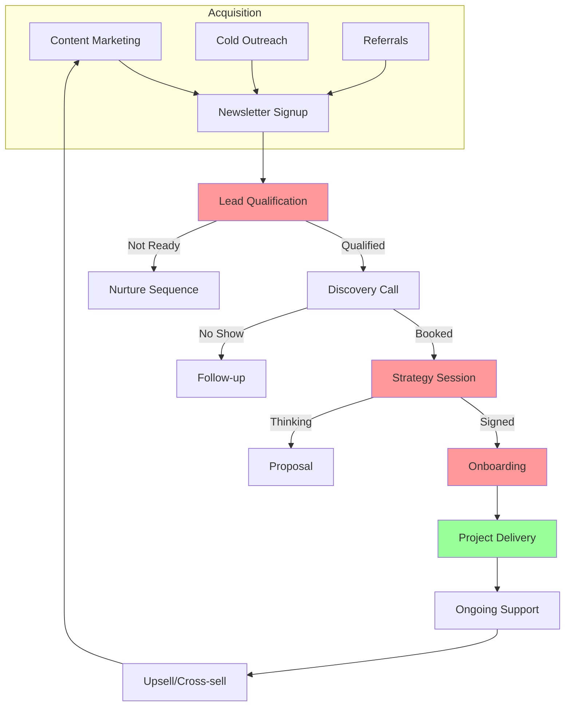

# Business Mapper - Live Demo Output

*This is an example of what the skill produces after interviewing a business owner*

---

## Business Overview

**Business:** MoltBot (AI-powered automation agency)
**Primary Service:** Custom AI agents and automation solutions
**Target Market:** Businesses wanting to leverage AI

---

## Visual Business Map

**Legend:** 🔴 = Bottleneck | 🟢 = Working Well

---

## Bottleneck Analysis

### 🔴 Critical Bottlenecks

| Area | Issue | Impact | Root Cause |
|------|-------|--------|------------|
| **Lead Qualification** | Manual review taking 2+ hours/day | Losing leads to faster competitors | No automated scoring |
| **Scheduling** | Back-and-forth emails for calls | 30% no-show rate | No self-booking calendar |
| **Onboarding** | Custom intake for each client | Projects delayed 3-5 days | No standardized questionnaire |

### 🟡 Medium Priority Issues

- Follow-ups inconsistent (some leads get 5 touches, others get 1)
- Proposal creation takes 2-3 hours each
- Project updates require manual client emails

---

## AI Opportunity Matrix

| Opportunity | Time Saved | Effort | Priority | Quick Win? |
|-------------|------------|--------|----------|------------|
| **Lead scoring AI agent** | 10 hrs/week | Medium | #1 | 🟡 |
| **Automated scheduling** | 5 hrs/week | Low | #2 | ✅ |
| **Onboarding chatbot** | 8 hrs/week | Medium | #3 | 🟡 |
| **Proposal generator** | 6 hrs/week | Low | #4 | ✅ |
| **Client update automation** | 4 hrs/week | Low | #5 | ✅ |
| **Content repurposing AI** | 8 hrs/week | Medium | #6 | 🟡 |

**Total Potential Time Savings: 41 hours/week**

---

## 90-Day Action Roadmap

### Month 1: Quick Wins (Weeks 1-4)

**Week 1-2: Setup**
- [ ] Set up Calendly or similar for scheduling
- [ ] Create proposal template system
- [ ] Document current onboarding process

**Week 3-4: First Automations**
- [ ] Automated follow-up sequences (HubSpot/Zapier)
- [ ] Proposal generator using Claude API
- [ ] Client status update automation

**Month 1 Target:** Save 10 hours/week

---

### Month 2: Core Systems (Weeks 5-8)

**Week 5-6: Lead Scoring**
- [ ] Define lead qualification criteria
- [ ] Build AI lead scoring agent
- [ ] Integrate with CRM

**Week 7-8: Onboarding Automation**
- [ ] Create standardized intake questionnaire
- [ ] Build onboarding chatbot
- [ ] Automate account setup

**Month 2 Target:** Save additional 15 hours/week (25 total)

---

### Month 3: Optimization (Weeks 9-12)

**Week 9-10: Content Automation**
- [ ] Build content repurposing workflow
- [ ] Automate newsletter from existing content
- [ ] Social media scheduling automation

**Week 11-12: Measurement & Scale**
- [ ] Track actual time savings
- [ ] Identify next automation opportunities
- [ ] Document SOPs for team

**Month 3 Target:** Save additional 10 hours/week (35 total)

---

## Recommended Tools

| Purpose | Tool | Cost |
|---------|------|------|
| Scheduling | Calendly | Free tier available |
| CRM | HubSpot/Follow Up Boss | Free-$50/mo |
| Automation | Zapier/Make | $0-$20/mo |
| Proposals | PandaDoc/ProposalPDF | $0-$50/mo |
| AI | Claude API | Pay per usage |

**Estimated Monthly Cost:** $50-100 for tools that save 35+ hours

---

## Key Insights

1. **You're spending 15+ hours/week on manual qualification** - An AI agent could handle this
2. **No standardized onboarding** - Every client starts differently, causing delays
3. **Content creation is a time sink** - AI can repurpose one piece into 5 formats
4. **Client communication is reactive** - Proactive updates would reduce questions

---

## First 3 Digital Assets to Build

1. **Lead Qualification Form** - Score leads automatically (Build: Week 2)
2. **Onboarding SOP** - Step-by-step client setup (Build: Week 3)
3. **Proposal Template Library** - Generate proposals in 15 minutes (Build: Week 4)

These 3 assets unlock 50% of your automation opportunities.

---

*Generated by Business Mapper v1.0 | Total Interview Time: 12 minutes*
