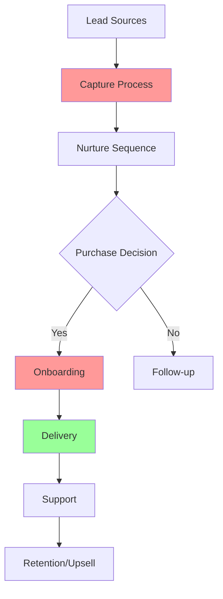

# Business Mapper - Free AI Skill

**A free alternative to Business X-Ray that maps your business, finds bottlenecks, and identifies AI automation opportunities.**

---

## What This Does

This skill transforms Claude into your business consultant. It will:

1. **Interview you** with strategic questions about your business
2. **Map your business** visually with customer journey diagrams
3. **Identify bottlenecks** where you're losing time or money
4. **Find AI opportunities** to automate 80-90% of repetitive work
5. **Create a roadmap** with clear next steps

---

## How To Use

### Step 1: Start the Interview

Simply tell Claude:

> "Run the Business Mapper skill on my business"

Claude will begin interviewing you with focused questions.

### Step 2: Answer Honestly

Answer each question in your own words. The more detail you provide, the better your map will be. Take 5-10 minutes per question.

### Step 3: Get Your Analysis

After the interview, Claude will generate:
- Visual business map (Mermaid diagram)
- Customer journey analysis
- Bottleneck identification
- AI automation opportunities
- 90-day action roadmap

---

## The Interview Framework

### Phase 1: Foundation

**Question 1: Business Core**
- What does your business do? Be specific.
- Who is your ideal customer?
- What problem do you solve for them?
- What's your primary offer/service?

**Question 2: Customer Journey**
- How do people first discover you? (all sources)
- What steps happen between discovery and purchase?
- What happens after they become a customer?
- How do you get repeat business?

### Phase 2: Operations

**Question 3: Your Weekly Activities**
- What do you spend time on each week? (list all activities)
- Which activities feel repetitive or could be delegated?
- What do you do that only YOU can do?
- What do you do that you wish you didn't have to do?

**Question 4: Key Processes**
- Walk me through your [sales/delivery/onboarding] process step by step
- Where do things slow down or get stuck?
- What tasks require manual intervention?
- What information gets passed between people/tools?

**Question 5: Tools & Assets**
- What tools do you use daily? (CRM, email, project management, etc.)
- What templates, checklists, or SOPs do you have?
- What digital assets do you wish you had?
- Where is information stored? (spreadsheets, docs, head, etc.)

### Phase 3: Opportunities

**Question 6: Pain Points**
- What frustrates you about your current operation?
- What tasks eat up unexpected time?
- Where do customers complain or ask questions?
- What feels like it "should be easier"?

**Question 7: Goals**
- What do you want to achieve in the next 90 days?
- If you could automate 3 things, what would they be?
- What would allow you to scale without working more hours?
- What's holding you back from growing?

---

## What You Get

### 1. Visual Business Map
A Mermaid diagram showing:
- Lead sources → Your funnel → Delivery → Retention
- Decision points and handoffs
- Where bottlenecks exist

### 2. Process Analysis
- Swimlanes showing who does what
- Time allocation breakdown
- Value vs. non-value work classification

### 3. Bottleneck Report
- Top 3 bottlenecks in your business
- Time impact of each
- Recommended solutions

### 4. AI Opportunity Matrix
| Opportunity | Impact | Effort | Priority |
|-------------|--------|--------|----------|
| [List of automations] | High/Med/Low | High/Med/Low | #1, #2, #3 |

### 5. 90-Day Roadmap
- Month 1: Foundation (templates, SOPs)
- Month 2: First automations
- Month 3: Optimization & scaling

---

## Sample Output Format

**Legend:**
- 🔴 Red = Bottleneck
- 🟢 Green = Working well
- 🟡 Yellow = Opportunity

---

## Tips for Best Results

1. **Be specific** - Instead of "I do marketing", say "I write 3 LinkedIn posts per week and send 20 cold emails daily"

2. **Include numbers** - "It takes me about 2 hours to create a client report" is better than "It takes a while"

3. **Think step-by-step** - Walk through processes as they actually happen, not as you wish they happened

4. **Don't filter** - Include everything, even things that seem small. Small friction points add up

5. **Be honest about pain** - What frustrates you? What do you procrastinate on? These are automation gold mines

---

## Comparison to Business X-Ray

| Feature | Business Mapper (Free) | Business X-Ray ($197) |
|---------|----------------------|---------------------|
| Business interview | ✅ 7 strategic questions | ✅ 7 questions |
| Visual mapping | ✅ Mermaid diagrams | ✅ Draw.io diagrams |
| Bottleneck ID | ✅ | ✅ |
| AI opportunities | ✅ | ✅ |
| Action roadmap | ✅ 90-day plan | ✅ 90-day plan |
| Cost | **FREE** | $197 |
| Draw.io setup | Not needed (uses Mermaid) | Required |
| Live workshop | ❌ | ✅ (bonus) |

---

## How Claude Should Respond

When activated, Claude should:

1. Explain what will happen
2. Ask questions one phase at a time
3. Follow up on answers to go deeper
4. After all questions, generate:
   - Mermaid diagram of the business
   - Written analysis with findings
   - Prioritized opportunity list
   - 90-day roadmap with milestones

---

## Version History

- **v1.0** - Initial release (March 2026)
  - Core interview framework
  - Mermaid diagram generation
  - Bottleneck and opportunity analysis
  - 90-day roadmap template

---

## License

This skill is free to use and modify. Created as an open alternative to paid business mapping tools.

---

**Ready to map your business? Just say: "Run the Business Mapper skill"**
