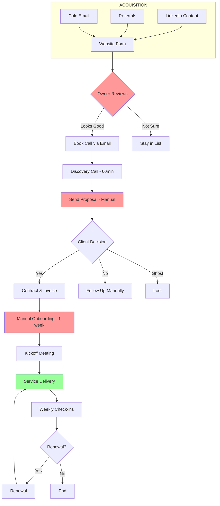
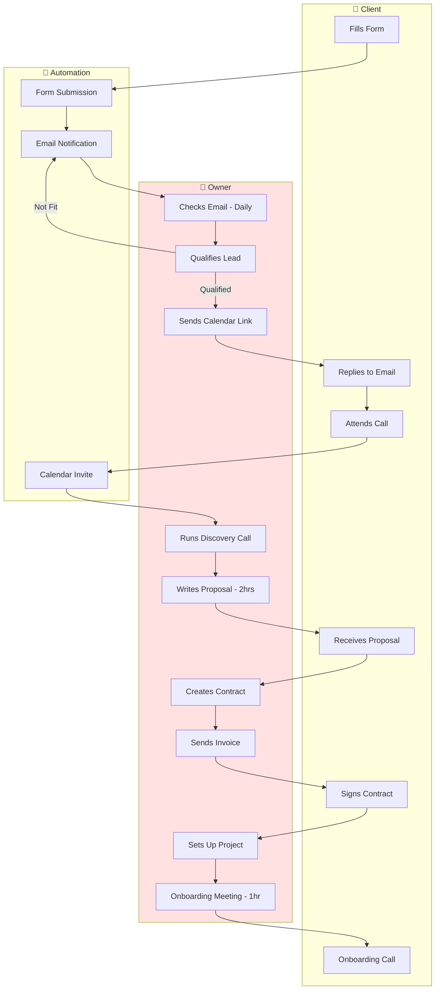

# Real-World Example: Marketing Agency

**Complete Business X-Ray output for a fictional marketing agency**

---

## Executive Summary

**Business:** Spark Digital Marketing
**Size:** 3 people (Owner + 2 contractors)
**Revenue:** $25K/month
**Main Issue:** Owner is bottleneck, can't scale

**Key Findings:**
- 🔴 Critical bottleneck in sales process (owner does everything)
- 🟡 Missing onboarding system causes 1-week delays
- 🟢 Delivery is working well
- 💡 Opportunity: 15 hours/week could be automated

---

## 1. Business Map & Bow-Tie Funnel



---

## 2. Process Swimlane (Sales Process)



**Problems Identified:**
- Owner handles EVERYTHING in sales
- Proposal takes 2 hours to write (no template)
- Onboarding takes 1 week (manual setup)
- No automated follow-up for ghosted prospects

---

## 3. Digital Assets Scorecard

| Asset | Current Level | Impact | Priority |
|-------|---------------|--------|----------|
| **Sales** | | | |
| Lead qualification criteria | 1 (Documented) | High | #2 |
| Discovery call script | 0 (In head) | Medium | #5 |
| Proposal template | 0 (Start from scratch) | High | **#1** |
| Contract template | 2 (Template exists) | High | - |
| Follow-up sequences | 0 (Ad hoc) | Medium | #4 |
| **Operations** | | | |
| Onboarding checklist | 0 (No process) | High | **#3** |
| Project timeline template | 2 (Template exists) | Medium | - |
| Client update template | 1 (Rough format) | Medium | #6 |
| Status report structure | 2 (Template exists) | Low | - |
| **Delivery** | | | |
| Content creation SOP | 3 (Documented) | High | - |
| Quality checklist | 2 (Checklist exists) | Medium | - |
| Revision process | 2 (Clear process) | Medium | - |

**Legend:** 0=In head, 1=Documented, 2=Template, 3=System, 4=Self-running

---

## 4. Work Type Analysis (Lean Six Sigma)

### Value-Adding Work (8 hrs/week) - KEEP
- Client strategy sessions
- Content creation
- Creative direction
- Client relationship management

### Non-Value-Adding Necessary (12 hrs/week) - AUTOMATE
- **Proposal writing** (4 hrs/week) → Template + AI
- **Lead qualification** (2 hrs/week) → Form + scoring
- **Onboarding setup** (3 hrs/week) → Automation
- **Status updates** (2 hrs/week) → Template
- **Invoicing** (1 hr/week) → Automation

### Waste (5 hrs/week) - ELIMINATE
- **Finding information** (2 hrs/week) → Better organization
- **Manual data entry** (2 hrs/week) → Integration
- **Unnecessary meetings** (1 hr/week) → Cancel or shorten

**Total Automatable: 17 hours/week**

---

## 5. Bottleneck Report

### 🔴 Critical Bottlenecks

| Bottleneck | Impact | Root Cause | Solution |
|------------|--------|------------|----------|
| **Proposal Creation** | 4 hrs/proposal, delays closing | No template, write from scratch | Create template library |
| **Owner in Sales** | Can't scale, maxed out | Owner does everything | Delegate qualification, use automation |
| **Onboarding Delays** | 1-week delay, poor first impression | Manual setup, no checklist | Automated onboarding flow |
| **No Follow-up System** | Lost prospects, ghosting | Remember to follow up | Automated sequences |

### Impact Summary
- Lost revenue from delayed proposals: ~$5K/month
- Lost prospects from poor follow-up: ~$3K/month
- Owner time burned on non-value work: 17 hrs/week

---

## 6. AI Opportunity Matrix

| Opportunity | Time Saved | Effort | Priority | Quick Win? |
|-------------|------------|--------|----------|------------|
| **Proposal template + AI assist** | 4 hrs/week | Low | **#1** | ✅ |
| **Lead qualification automation** | 2 hrs/week | Low | **#2** | ✅ |
| **Onboarding checklist** | 3 hrs/week | Low | **#3** | ✅ |
| **Follow-up sequences** | 2 hrs/week | Medium | #4 | 🟡 |
| **Client update template** | 2 hrs/week | Low | #5 | ✅ |
| **Contract automation** | 1 hr/week | Medium | #6 | 🟡 |
| **CRM integration** | 2 hrs/week | High | #7 | 🔴 |
| **Content repurposing AI** | 3 hrs/week | Medium | #8 | 🟡 |

**Total Potential Time Savings: 19 hours/week**

---

## 7. 90-Day Action Roadmap

### Month 1: Quick Wins (Weeks 1-4)

**Week 1-2: Sales Templates**
- [ ] Create 3 proposal templates (retainer, project, hybrid)
- [ ] Build qualification checklist
- [ ] Write discovery call script
- [ ] **Target:** Save 4 hrs/week on proposals

**Week 3-4: Onboarding Fix**
- [ ] Create onboarding checklist
- [ ] Build new client intake form
- [ ] Document onboarding process
- [ ] Setup project template
- [ ] **Target:** Cut onboarding from 1 week to 1 day

**Month 1 Result:** Save 7 hours/week, improve client experience

---

### Month 2: Automation (Weeks 5-8)

**Week 5-6: Lead Automation**
- [ ] Setup lead scoring on website form
- [ ] Create auto-responder email sequence
- [ ] Build calendar self-booking
- [ ] **Target:** Save 2 hrs/week on qualification

**Week 7-8: Follow-up System**
- [ ] Create 5-email follow-up sequence
- [ ] Setup automated reminders
- [ ] Build proposal follow-up automation
- [ ] **Target:** Recover 2-3 lost prospects/month

**Month 2 Result:** Save additional 4 hours/week, increase close rate

---

### Month 3: Optimization (Weeks 9-12)

**Week 9-10: Client Communication**
- [ ] Create client update template
- [ ] Build status report automation
- [ ] Setup automated check-in reminders
- [ ] **Target:** Save 3 hrs/week on communication

**Week 11-12: Integration & Scale**
- [ ] Connect CRM to all tools
- [ ] Build content repurposing workflow
- [ ] Document all processes for team
- [ ] **Target:** Ready to delegate to contractor

**Month 3 Result:** Save additional 5 hours/week, can now delegate

---

## Summary of Transformation

### Before
```
Owner does everything
├── Sales: Owner handles all (bottleneck)
├── Proposals: Write from scratch (4 hrs each)
├── Onboarding: Manual, 1-week delay
├── Follow-up: Remember to do it (often forget)
└── Capacity: Maxed out at $25K/month
```

### After
```
System-driven business
├── Sales: Qualified leads auto-surface
├── Proposals: Template + AI customize (30 min)
├── Onboarding: Automated checklist, 1 day
├── Follow-up: Automated sequences
└── Capacity: Can scale to $50K+ without more hours
```

### Results
- **Time saved:** 16 hours/week
- **Revenue capacity:** 2x without more work
- **Client experience:** Much better/faster
- **Owner sanity:** No longer bottleneck

---

## Next 3 Digital Assets to Build

### 1. Proposal Template Library (Week 1)
**What:** 3 templates for common service types
**Why:** Saves 3.5 hours/proposal, faster turnaround
**AI use:** Claude customizes based on client info
**Time to build:** 4 hours

### 2. Onboarding Checklist (Week 2)
**What:** Step-by-step new client process
**Why:** Cuts 1-week delay to 1 day, better experience
**AI use:** Automated reminders and progress tracking
**Time to build:** 3 hours

### 3. Lead Qualification System (Week 3)
**What:** Form + scoring + auto-response
**Why:** Owner only talks to qualified leads
**AI use:** Auto-qualifies based on responses
**Time to build:** 4 hours

**Total build time: 11 hours**
**Total weekly savings: 9 hours**
**Payback: 1.5 weeks**

---

*This example shows the complete output. Your Business X-Ray will be customized to your actual business.*
