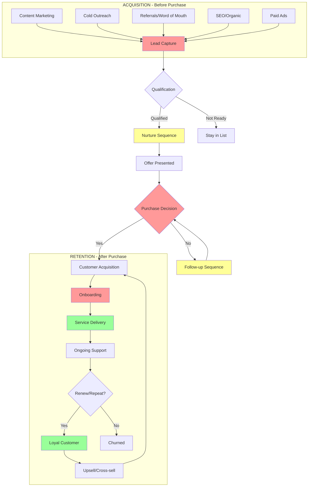
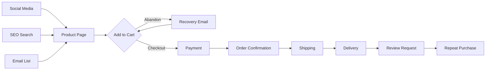
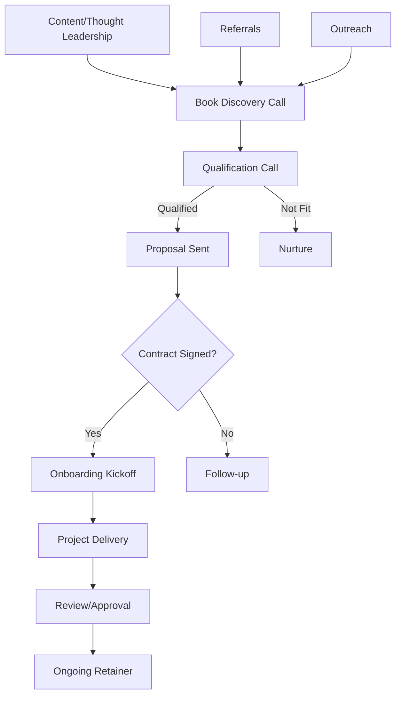
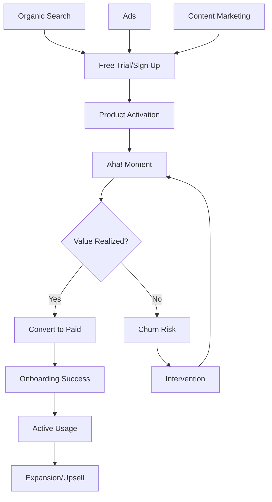
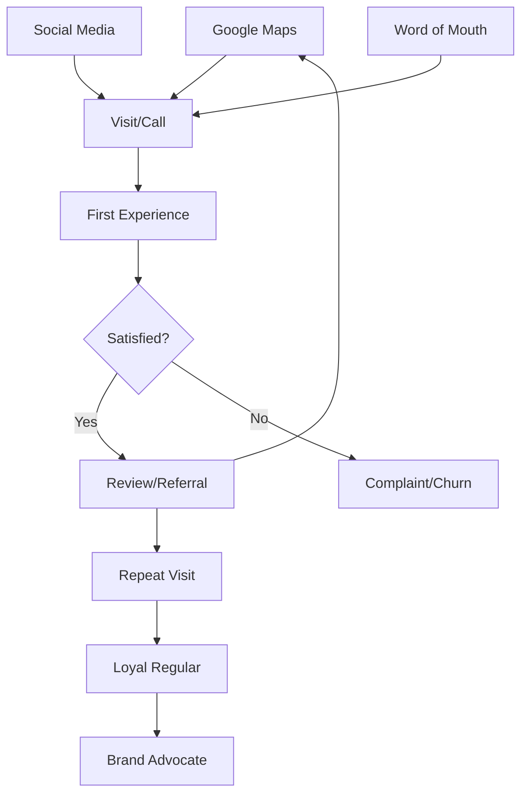

# Business Map & Bow-Tie Funnel Generator

**Template for creating visual business maps**

---

## Bow-Tie Funnel Structure

The bow-tie funnel shows your complete customer journey from stranger to repeat buyer:

```
      ACQUISITION        CONVERSION          RETENTION
         ──────           ────────           ────────

    ┌─────────┐      ┌─────────┐        ┌─────────┐
    │  LEAD   │      │  SALE   │        │ REPEAT  │
    │ SOURCES │ ───→ │ FUNNEL  │  ───→  │ PURCHASE│
    └─────────┘      └─────────┘        └─────────┘
         ↑                ↑                  ↑
    [Stranger]      [Customer]         [Loyal Fan]
         │                │                  │
         └────────────────┴──────────────────┘
                    Your Business
```

---

## Mermaid Template (Copy & Modify)



---

## Industry-Specific Templates

### E-commerce Business



### Service Business (Agency/Consulting)



### SaaS/Product Business



### Local Business (Restaurant/Service)



---

## Customization Guide

### Step 1: List Your Lead Sources
Replace the lead sources in the template with your actual sources:
- Social media platforms
- Referral sources
- Paid channels
- Organic/search
- Partnerships

### Step 2: Define Your Conversion Steps
What happens between discovery and purchase?
- Lead magnet download
- Email sequence
- Sales call
- Proposal
- Payment

### Step 3: Map Your Delivery
What happens after purchase?
- Onboarding
- Service delivery
- Support
- Fulfillment

### Step 4: Identify Retention Paths
How do customers come back?
- Renewals
- Repeat purchases
- Upsells
- Referrals

---

## Finding Your Bottlenecks

Use this checklist to identify where things break:

| Stage | Red Flag | Bottleneck Indicator |
|-------|----------|---------------------|
| **Lead Capture** | Low conversion | < 20% convert to lead |
| **Qualification** | Time waste | > 50% of leads unqualified |
| **Nurture** | Ghosting | No response to outreach |
| **Sales** | Low close rate | < 20% convert to customer |
| **Onboarding** | Delays | Takes > 3 days to start |
| **Delivery** | Complaints | > 10% request changes |
| **Retention** | High churn | > 20% don't return |

---

## Color Coding Legend

When reviewing your map:

- 🔴 **Red (Bottleneck)** - Things breaking, slowing down, or failing
- 🟡 **Yellow (Opportunity)** - Working but could be better
- 🟢 **Green (Working)** - Don't touch, what's working well
- 🔵 **Blue (Automation)** - Good candidate for AI automation

---

## Example: Analyzing a Map

**Before Optimization:**
```
Lead → Manual Email → Manual Call → Manual Proposal → Manual Contract → Manual Onboarding
         ↑ Bottleneck        ↑ Bottleneck           ↑ Bottleneck
```

**After Optimization:**
```
Lead → Auto Email → Qualified Call → Auto Proposal → E-Sign → Auto Onboarding
         ↑ Automated           ↑ Template          ↑ Automated
```

**Result:** 5 bottlenecks removed, 3 days → 3 hours to close

---

## Next Steps After Mapping

1. **Identify your #1 bottleneck** - Where do you lose the most people/time?
2. **Document the current process** - What actually happens now?
3. **Design the ideal process** - What should happen?
4. **Build the asset** - Template, automation, or system
5. **Test and measure** - Did it improve?

---

*Use this template with the Business X-Ray skill to generate your custom map*
