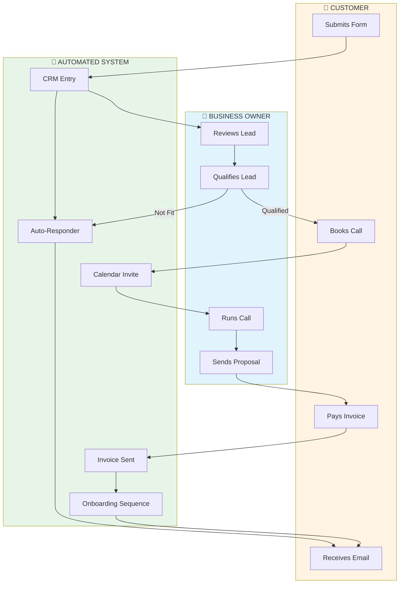
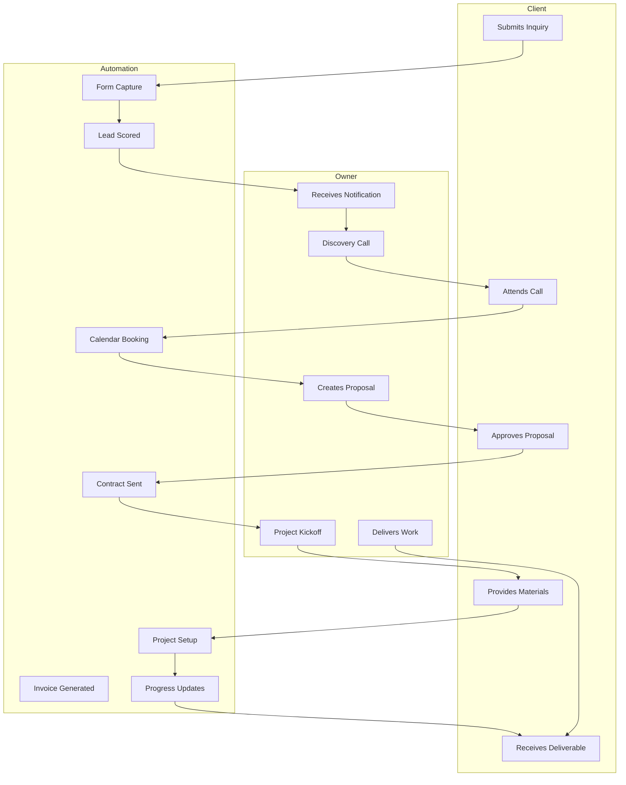
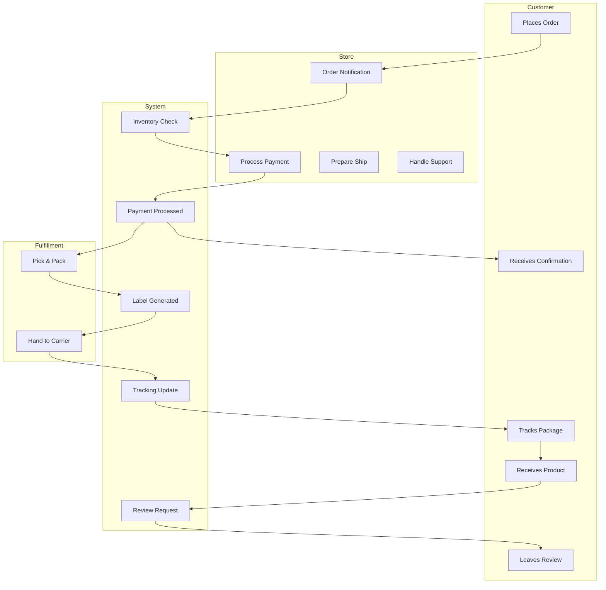

# Process Swimlane Template

**Map who does what, when, and where handoffs fail**

---

## What Are Process Swimlanes?

Swimlanes show the flow of work across different people, teams, or systems. They reveal:
- Who is responsible for each step
- Where handoffs happen (and fail)
- Parallel vs. sequential work
- System dependencies

---

## Basic Swimlane Structure

```
┌───────────────────┬───────────────────┬───────────────────┬───────────────────┐
│     CUSTOMER      │       YOU         │       TEAM        │      SYSTEM       │
├───────────────────┼───────────────────┼───────────────────┼───────────────────┤
│                   │                   │                   │                   │
│  [Start Here]     │                   │                   │                   │
│       ↓           │                   │                   │                   │
│                   │                   │                   │                   │
│             ─────→│  [Your Action]    │                   │                   │
│                   │       ↓           │                   │                   │
│                   │             ─────→│  [Team Action]    │                   │
│                   │                   │       ↓           │                   │
│                   │                   │             ─────→│ [Automated]       │
│                   │                   │                   │       ↓           │
│                   │                   │                   │             ─────→│
│                   │                   │                   │                   │
│                   │                   │                   │       ↓           │
│             ←─────┼───────────────────┼───────────────────┤    [Notification]│
│       ↓           │                   │                   │                   │
│  [Customer Action]│                   │                   │                   │
│                   │                   │                   │                   │
└───────────────────┴───────────────────┴───────────────────┴───────────────────┘
```

---

## Mermaid Swimlane Template



---

## Industry Examples

### Service Agency Swimlane



### E-commerce Order Flow



---

## Identifying Handoff Problems

Handoffs are where things break. Use this checklist:

| Handoff Point | Common Issues | Solution |
|---------------|---------------|----------|
| **Customer → You** | Lost leads, slow response | Auto-acknowledge, ticket system |
| **You → Team** | Unclear instructions, dropped balls | Templates, checklists, handoff doc |
| **Team → System** | Manual entry, errors | Direct integration, API |
| **System → Customer** | No notification, poor timing | Automated updates at right time |

---

## Process Discovery Questions

To build your swimlane, answer:

1. **Who triggers the process?** (Customer? System? Schedule?)
2. **What happens first?** (Immediate action? Notification?)
3. **Who does what?** (Owner? Team member? Automation?)
4. **What information is passed?** (Data? Documents? Context?)
5. **Where does it wait?** (Approval? Payment? Scheduling?)
6. **What can go wrong?** (Missing info? Delays? Errors?)
7. **How does it end?** (Delivery? Notification? Next step?)

---

## Optimizing Handoffs

### Before (Manual Handoffs)
```
Customer Email → You Check → You Reply → Manual Schedule → Manual Reminder
      ↑ bottleneck      ↑ bottleneck          ↑ bottleneck
```

### After (Smooth Handoffs)
```
Customer Form → System Captures → Auto Reply → Self-Schedule → Auto Reminders
      ↑ automated         ↑ automated              ↑ automated
```

### Key Improvements:
- **Eliminated waiting** - System processes immediately
- **No dropped leads** - Everything is captured
- **Better experience** - Customer gets instant response
- **Less manual work** - Owner only handles qualified leads

---

## Template: Handoff Document

When handing off between people/teams:

```markdown
## Handoff: [Process Name]

**From:** [Name/Role]
**To:** [Name/Role]
**Date:** [Date]

### Context
[Why this is happening, background]

### What's Been Done
- [ ] Step 1 completed
- [ ] Step 2 completed
- [ ] Step 3 completed

### What Needs To Happen
- [ ] Action 1 needed
- [ ] Action 2 needed
- [ ] Action 3 needed

### Key Information
- Customer: [Name]
- Value: [$]
- Timeline: [Dates]
- Special notes: [Details]

### Access Needed
- [ ] Link to project
- [ ] Folder access
- [ ] Tool credentials

### Success Criteria
[What does "done" look like?]
```

---

## Automation Targets in Swimlanes

Look for these automation opportunities:

| Pattern | Current State | Automation Opportunity |
|---------|---------------|----------------------|
| **Data entry** | Manual typing into multiple systems | Integration/API |
| **Notifications** | Remembering to notify people | Triggered alerts |
| **Scheduling** | Back-and-forth emails | Self-booking calendar |
| **Follow-ups** | Remembering to check back | Automated sequences |
| **Reminders** | Manual calendar entries | Scheduled notifications |
| **Status updates** | "Where are we on this?" emails | Automated progress reports |
| **Document generation** | Creating from scratch each time | Template + automation |

---

## Quick Start

To create your swimlane:

1. **Pick ONE process** to map (sales, onboarding, delivery)
2. **List all the actors** (customer, you, team, systems)
3. **Walk through step by step** - what actually happens?
4. **Mark the handoffs** - where does responsibility change?
5. **Identify problems** - where does it break or slow down?
6. **Design improvements** - what should be automated or templated?

---

*Use with the Business X-Ray skill to generate your custom swimlanes*
